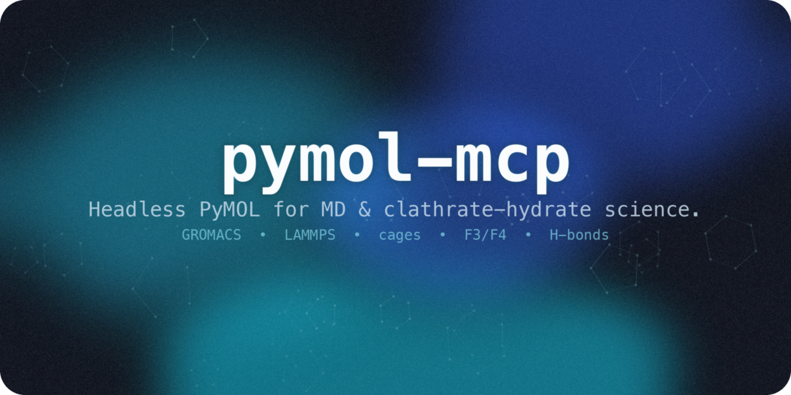
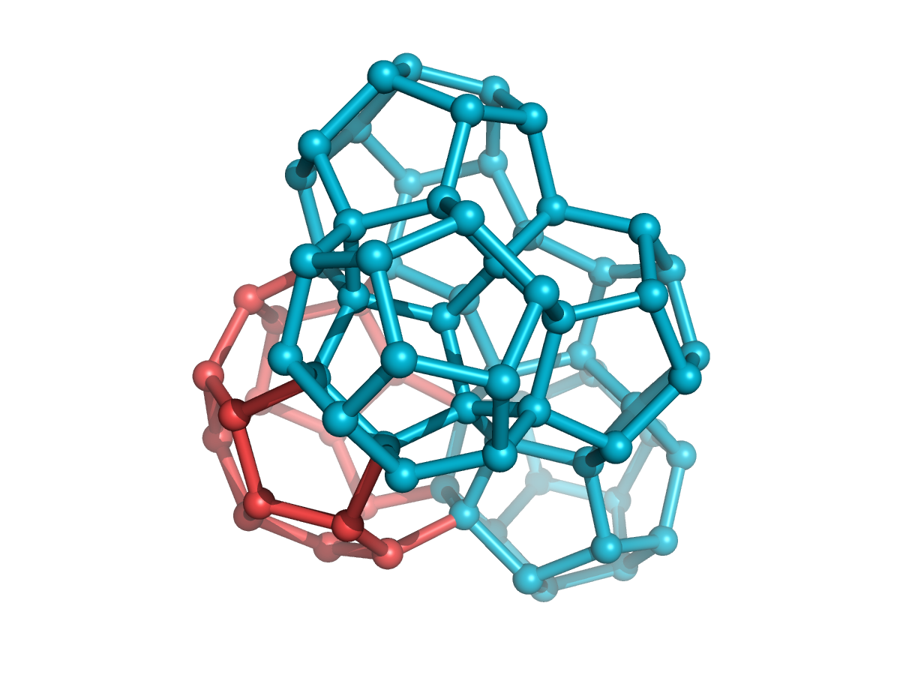

<p align="center"></p>

<h1 align="center">pymol-mcp</h1>
<p align="center">
  <em>Headless PyMOL as an MCP server — drive molecular visualization, GROMACS/LAMMPS trajectories, and clathrate-hydrate cage science from your LLM.</em>
</p>
<p align="center">
  <a href="#demo">Demo</a> · <a href="#quick-start">Quick Start</a> · <a href="#highlights">Highlights</a> · <a href="#features">Features</a> · <a href="#tool-catalog">Tools</a> · <a href="#domain-clathrate-hydrate-science">Cage Science</a> · <a href="./README-Ko-KR.md">한국어</a>
</p>
<p align="center">
  
  
  
  
  
</p>

---

> [!NOTE]
> An MCP server that embeds **PyMOL in-process, headless** — no GUI, no socket plugin, no manual setup.
> It exposes 30+ **typed** tools, **returns rendered images inline** so the model can see what it draws,
> loads **GROMACS/LAMMPS** trajectories, and ships a **clathrate-hydrate analysis** toolkit
> (H-bond networks, F3/F4 order parameters) with **numerically validated** science.

## Demo

<p align="center"></p>
<p align="center"><em>Ask in plain language → the model calls typed tools → headless PyMOL renders it. (<a href="./assets/pymol-mcp-demo.mp4">full-quality MP4</a>)</em></p>

## Highlights

| | |
|---|---|
| **Runtime** | Embedded, **headless** `pymol2` — no GUI, no plugin, no socket |
| **Tools** | **30+ typed tools** with real, structured return values |
| **Vision** | ray-traced PNG **returned inline** so the model sees what it draws |
| **MD trajectories** | GROMACS `.xtc/.trr` + LAMMPS dump (MDAnalysis bridge) |
| **Domain science** | cage perception (TRACE), occupancy, H-bonds, F3/F4 — **validated** |
| **Robustness** | worker-thread session, **stdout-safe** transport, pytest suite |
| **Safety** | arbitrary-code passthrough **off by default** |

## Features

- **Embedded & headless** — one long-lived PyMOL instance on a dedicated worker thread; nothing to click, works in CI.
- **The model can *see*** — `render_image` ray-traces and returns a PNG as MCP image content.
- **MD-native** — load GROMACS `.gro`+`.xtc`, or bridge LAMMPS/NetCDF/… through MDAnalysis with in-memory coordinate injection.
- **Clathrate-hydrate toolkit** — H-bond networks and **F3/F4** order parameters ported from a validated Rust engine, all in nm with correct triclinic PBC.
- **Typed, safe tools** — every argument is schema-validated; the arbitrary-code passthrough is **opt-in** (`PYMOL_MCP_ALLOW_CODE_EXEC=1`).
- **Protocol-hardened** — PyMOL's chatty stdout is permanently redirected so it can never corrupt the JSON-RPC stream (with a subprocess test that proves it).

## Quick Start

> [!IMPORTANT]
> PyMOL open-source is a **conda** package, and the server must run in a Python that can `import pymol2`.
> Install into that interpreter — do **not** use `uvx`/`fastmcp install` (they build isolated envs without PyMOL).

```bash
# 1. Create the environment (or reuse one that already has pymol-open-source)
conda env create -f env.yml        # env named `pymol-mcp`
conda activate pymol-mcp

# 2. Install this package (with the optional MD bridge + dev tools)
pip install -e ".[md,dev]"

# 3. Verify
pytest -q
```

It's a standard **MCP server over stdio**, so it works with any MCP-capable client (Claude Code / Desktop,
Codex CLI, Gemini CLI, Cline, Continue, …). Point the command at the **absolute** conda interpreter so it
can `import pymol2`.

Most clients use an `mcpServers` block (Claude Code / Desktop, Gemini CLI, Cline, Continue, …):

```json
{
  "mcpServers": {
    "pymol": {
      "command": "/absolute/path/to/conda/envs/pymol-mcp/bin/python",
      "args": ["-m", "pymol_mcp"]
    }
  }
}
```

<details>
<summary><b>Codex CLI</b> — <code>~/.codex/config.toml</code></summary>

```toml
[mcp_servers.pymol]
command = "/absolute/path/to/conda/envs/pymol-mcp/bin/python"
args = ["-m", "pymol_mcp"]
```
</details>

Prefer not to hardcode a path? Use `"command": "conda", "args": ["run", "-n", "pymol-mcp", "python", "-m", "pymol_mcp"]` instead (requires `conda` on the client's PATH). See [llms-install.md](./llms-install.md) for a full from-scratch setup.

To enable the opt-in scripting tools, add `"env": {"PYMOL_MCP_ALLOW_CODE_EXEC": "1"}` to the server entry.

Then ask your agent things like:

```
Load ./hydrate.gro, color water by F4 order parameter, and render it.
Load md.gro + traj.xtc, show CO2 guests as spheres, render frame 50.
What's the mean H-bond coordination of the water in this structure?
```

## Tool Catalog

| Group | Tools |
|-------|-------|
| **Session / IO** | `load_structure` · `fetch_pdb` · `list_objects` · `get_object_info` · `reset_session` |
| **Selection** | `select` · `get_selection_info` |
| **Representation** | `show` · `hide` · `color` · `spectrum` · `set_background` |
| **View / Render** | `orient` · `zoom` · `turn` · `render_image` → 🖼️ inline PNG |
| **Measurement** | `measure_distance` · `measure_angle` · `measure_dihedral` · `align` · `save_file` |
| **Trajectory / MD** | `load_trajectory` (GROMACS/DCD) · `load_trajectory_mda` (LAMMPS/NetCDF via MDAnalysis) |
| **Clathrate domain** | `identify_cages` (TRACE) · `cage_occupancy` · `mark_cages` · `hbond_network` · `order_parameter` (F3 / F4) |
| **Scripting (opt-in)** | `run_pml` · `run_python` |

## Domain: clathrate-hydrate science

Ported from a validated Rust reference implementation and re-checked against ground truth. All analysis runs in
**nanometres** with a correct fractional-coordinate **minimum-image convention** (orthorhombic *and* triclinic),
a signed `atan2` dihedral for F4, and a periodic-image KDTree for neighbour search.

- **`identify_cages`** — full TRACE cage perception: ring finding → geometric validation → constraint-propagation assembly → Euler (SEC) validation → face-count typing (5¹², 5¹²6², 5¹²6⁴, …) and an sI/sII/sH structure call.
- **`cage_occupancy`** — assign guest molecules (CO₂/CH₄) to cages and report per-type occupancy (θ_S, θ_L).
- **`mark_cages`** — drop a colored sphere at each cage centre so `render_image` can show the cage lattice.
- **`order_parameter`** — F4 (torsional) and F3 (three-body angular). F4 ≈ 0.7–0.95 → hydrate, ≈ 0 → liquid, ≈ −0.4 → ice Ih.
- **`hbond_network`** — water H-bond graph (O–O ≤ 0.36 nm and a donor H–O···O angle < 35°) with coordination stats.

<p align="center"><br/><em>Detected sII cages drawn as wireframe polyhedra: 5¹² dodecahedra (cyan) around a 5¹²6⁴ cage (red), sharing faces.</em></p>

> [!TIP]
> **Validated against ground truth:** on a structure II reference, `identify_cages` finds exactly **128 × 5¹²
> + 64 × 5¹²6⁴** cages (the textbook 2:1 sII lattice), and on structure I exactly **16 × 5¹² + 48 × 5¹²6²**;
> F4 over the first ten waters reproduces the reference value **0.926698** exactly, F3 = 0.0028
> (hydrate-like ≤ 0.04), and the H-bond network is a perfect tetrahedral (mean coordination 4.00) framework.

## How it works

```
   MCP client (Claude · Codex · Gemini …)
          │  stdio JSON-RPC
          ▼
 ┌───────────────────────────────────────────────┐
 │  pymol-mcp  (FastMCP, conda env with pymol2)    │
 │   • permanent stdout redirect (protocol-safe)   │
 │   • ONE worker thread owns + drives pymol2      │
 │   • typed @mcp.tool functions                   │
 └───────────────────────────────────────────────┘
      │ cmd.* (headless)        │ numpy / scipy (nm)
      ▼                          ▼
  PyMOL 3.x  ── ray → PNG    analysis/ (hbond, F3/F4)
                              coords via iterate_state
```

## Requirements

| Dependency | Required | Purpose |
|-----------|----------|---------|
| Python 3.11+ (conda) | Yes | Runtime that can `import pymol2` |
| `pymol-open-source` 3.x | Yes | The visualization engine (conda) |
| `fastmcp` 3.x, `numpy`, `scipy` | Yes | MCP server + analysis |
| `MDAnalysis` | No (extra `md`) | LAMMPS / NetCDF / xtc bridge (GPL-2.0+) |
| `ffmpeg` | No | Movie export (future) |

## Contributing

Issues and PRs welcome — see [CONTRIBUTING.md](./CONTRIBUTING.md).

## License

[MIT](./LICENSE). The optional `md` extra pulls **MDAnalysis** (GPL-2.0-or-later), imported lazily; the core
package stays MIT.
